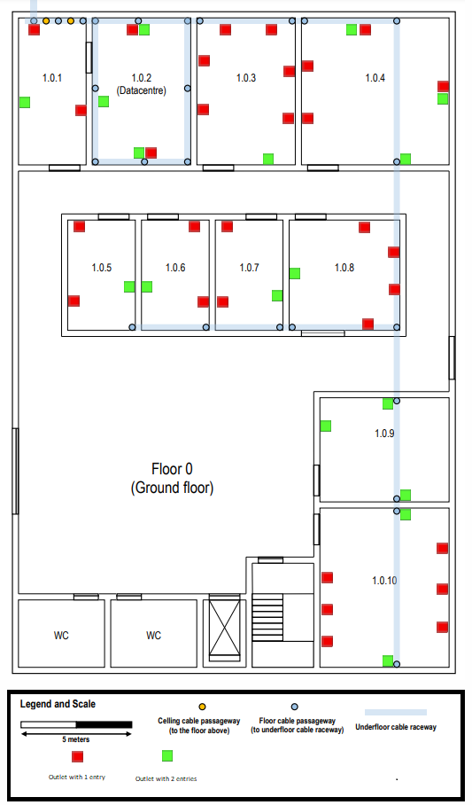
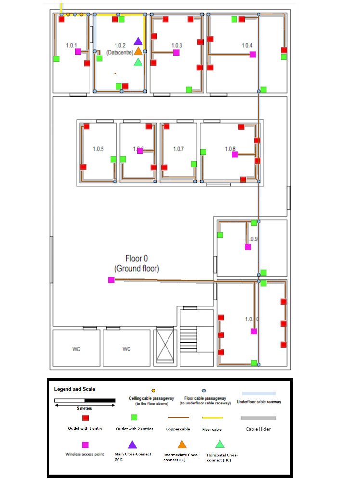
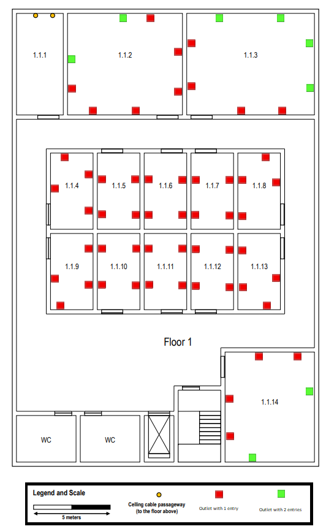
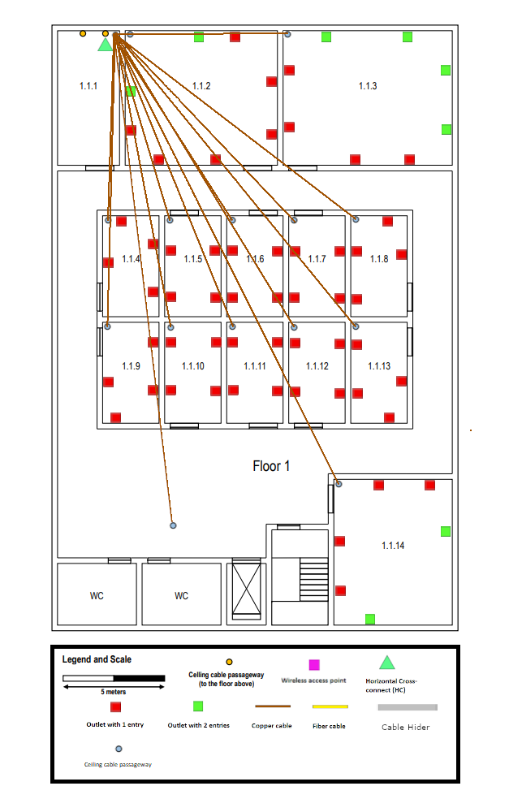
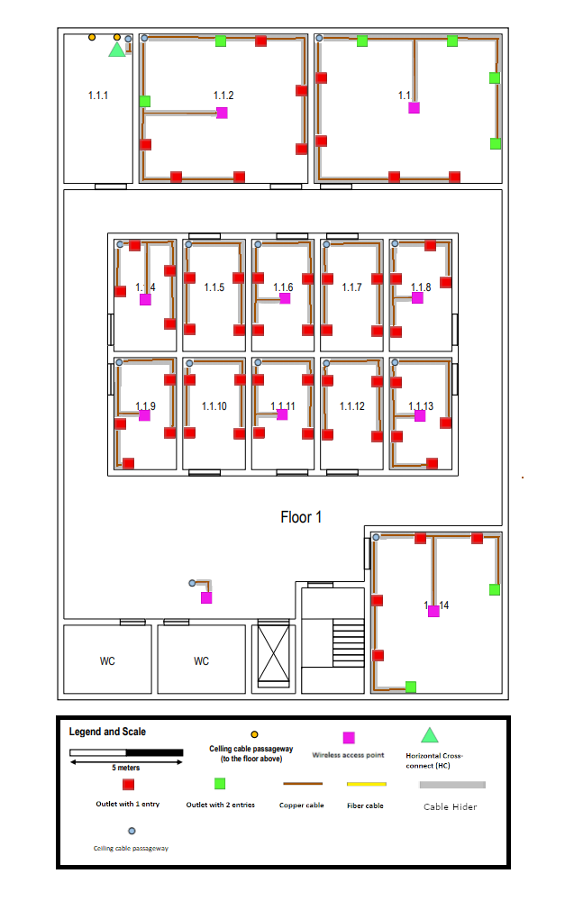
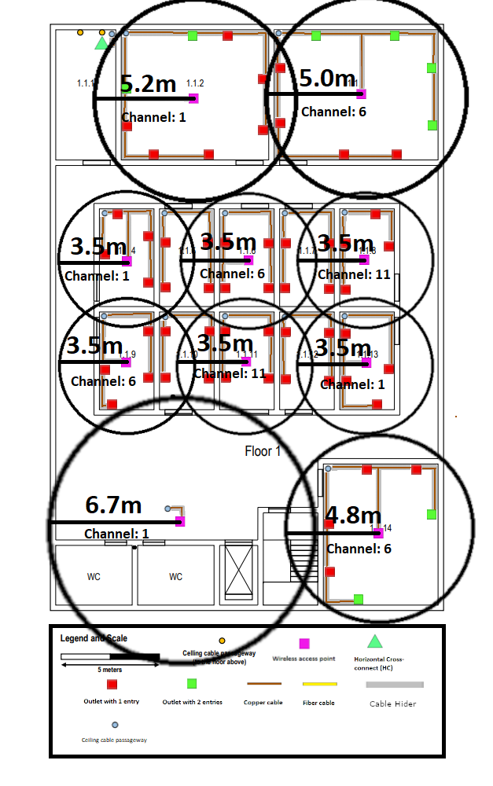

RCOMP 2021-2022 Project - Sprint 1 - Member 1200991 folder
===========================================

    This File will detail all the infrastructural changes needed to implement not only networking
    and wireless connections the whole of building 1 but also the Campus Backbone responsible for all the other building.

# **Building 1** 

Building 1 is responsible for the telecommunications room and as such will incorporate the connection between all other building as well as all the connection of both its floors.

Furthermore, it is important to note that all the costs related to all equipment necessary will be available in the file *"cabling inventory"* that is in the same directory.

To ensure fail-safe security 4-Pair optic fibre cables will be used in any situation where optic fiber is used, this ensures that should one of them be damaged there will be 3 other pairs that serve as failsafe.

Each floor will be explained separately detailing the outlet positioning, the cabling, the cross-connections organisation, and the access point set up.

## **Floor 0**

### **Enclosures**
    Before anything else the placement of the campus backbone must be placed leaving way for the further implementation of the network infrastructure. As such and as it was described in the project the Main Cross-Connect (MC) will be placed in the room 1.0.2.

    Due the fact the Main cross connect ends up taking a rather small space, for the sake of tidiness and organisation the enclosure housing the MC will also be housing the Intermediate Cross-Connect (IC) of building 1.

    As can be seen in the above demonstration the Main cross connect should be prepared to handle only optical fibre to ensure fast connection to all other IC across the campus. Bellow the MC will be located the IC that will be conected to the other two Horizontal cross-connects (HC) of building 1, this device will only need to receive copper cables and through the gigabit outlet will send optical fibre directly to the MC. Because of the lack of information regarding possible future planning taking place, the enclosure size will be double the needed units ending up with a 12u enclosure.

    Finally, another enclosure will house the Horizontal Cross-connect, since a large amount of cable's (around 80) will be coming into this enclosure there is a need to separate it from the MC/IC enclosure.

    This enclosure will house 4 patch panels receiving cables from all the other end-user devices stemming from floor 0, but as they all will need to sync up with the IC there is a need to reduce the cable amount for easier handling in the future, as such every switch is linked with an extra switch that consolidates all other switches and further sends their information to the IC, All of these connections are made of 4 cooper cables to prevent the fall of the system should one of them be damaged.
    The perfect enclosure for this HC would be a 30u rack but since 32 racks are allot more accessible, they were chosen instead.

### **Outlets**

    To make sure that every room as an ample selection of outlets we make sure that every room as 2 outlets per 10 m^2 of area. More rules were added where for instance, outlets should be away from the main door because there won't exist any devices and that almost every wall of the room would have access to at least 1 outlet. As such we end up with an outlet positioning like this:

    Having the end positions of every outlet lets us now delve into the cable positioning as well as how we get those cables in said rooms.
    For this we make use of the underfloor raceway, that leads to every single room. Once in the room cable hiders are used to discreetly move cables around in a way that is aesthetically more pleasing than simple cables.
    And then Access point, which have outlets themselves are added, being treated just like any other outlet.
    It is important to keep in mind that every outlet will be placed 0.5m above ground and that access points will be in the ceiling, these alterations in altitude should also be accompanied with cable hiders.
    With this in mind we end up with the following floor plan.

  

### **Wi-fi**

    Access Points are able to configure both their reach and their channels, as such it is possible to set up a vast wireless network while having some outlets imposing each other and also that no outlet has to take care of a heavy number of devices at once.
    For this end the access points are to be calibrated such as every single one does not have a neighbouring access point with the same channel and that every access point is taking care of less than 30 devices at once, devices in this case being reasoned by 2 devices per outlet.
    Keeping these values in mind we end up with the following setting:

  

## **Floor 1**

### **Enclosures**
    This floor's enclosure will house a simple Horizontal Cross-connect in room 1.1.1, and since it will be receiving around the same number of cables as the HC in floor 0 it will have the design much like it.

    Not much changes except for the cables connecting the main switch to the IC needing to be longer as the enclosure will be farther away.

### **Outlets**

    This floor much like floor 0 needs an outlet for every 10m^2 and the outlets will be away from doors ensuring every wall as access to outlets.
  
  
    
    The biggest difference is that:
    - Floor 1.1.1 does not need any outlets as it will house the floors HC
    - The lack of underfloor raceways is compensated by an existing drop ceiling which will be used to connect directly from room 1.1.1 to every other room

    Firstly, the ceiling cables should be positioned in such a way that the connection is a straight as possible to the given room

   

    The room cabling will be hidden by cable hiders, keeping in mind that every outlet is 0.5m from the ground as such they need to be pulled down to that height level, The access Points in turn do not have such constraints as they are positioned at around the same height level as the ceiling
    With this in mind we end up with the following floor plan.

  

### **Wi-fi**

    In This floor access points are configured in much the same way as the floor below as in they are to be configured between the channels 1, 6 and 11 and that not one should be in charge of handling more than 30 devices at once.
    In the we end up with these settings.

  

## **Inventory**

Things to keep in mind:
- Every cable must have 5 meter of leeway in order to accommodate future changes in the building plans;
- Every device height must be accounted for length count;
- Double outlets count as 2 cables but only as 1 cable hider;
- Patch panels double the amount of incoming cables in order to connect to the switch, a lot of changes in the amount of cables but so much in the length department;
- Cables connecting different switches need to be accounted for;
- Every Access Point has an outlet "attached" but the cable to connect both is not counted as it is technically an extra cable;
- There are 2 types of cord hiders, one is used for regular rooms and accepts around 12 cables the other is only used the HC room in floor 1 because it has to hide a large amount of cables going into the ceiling;

|Item|Quantity|Length/m|
|---|---|---|
|Single Outlet|102|NA|
|Double Outlet|25|NA|
|Access Point|18|NA|
|Small Cord Hider|NA|511.2|
|Big Cord Hider|NA|4.4|
|Copper cable Switches|11|NA|
|Copper cable Patch Panels|11|NA|
|Optic fibre Switch|1|NA|
|Optic fibre Patch Panel|1|NA|
|32U Rack|2|NA|
|12U Rack|1|NA|
|Copper Cable|152|4349.3|
|Optic Fibre Cable|6|549|

In the end the total spent was 20521.50€
