RCOMP 2021-2022 Project - Sprint 1 - Member 1201029 folder
===========================================

# 1. Building 3
## 1.1. Outlets placement
When it comes to the placement of the outlets, the only thing that was mentioned is that neither the restrooms nor the rooms 3.0.9 and 3.1.10 need to have outlets, therefore when placing the outlets the best practice rule was used where there should be 2 outlets for every 10 square meters. In the [Technical Decisions](../planning.md) the group came to the conclusion that the outlets should all be placed 0,5m above the floor.

### 1.1.1. Floor 0
When distributing the outlets the first thing that is necessary to do is to measure the different rooms in order to figure out how many outlets each room is gonna require.

For that it was necessary to use the given scale and after making all of the measurements this were the results:

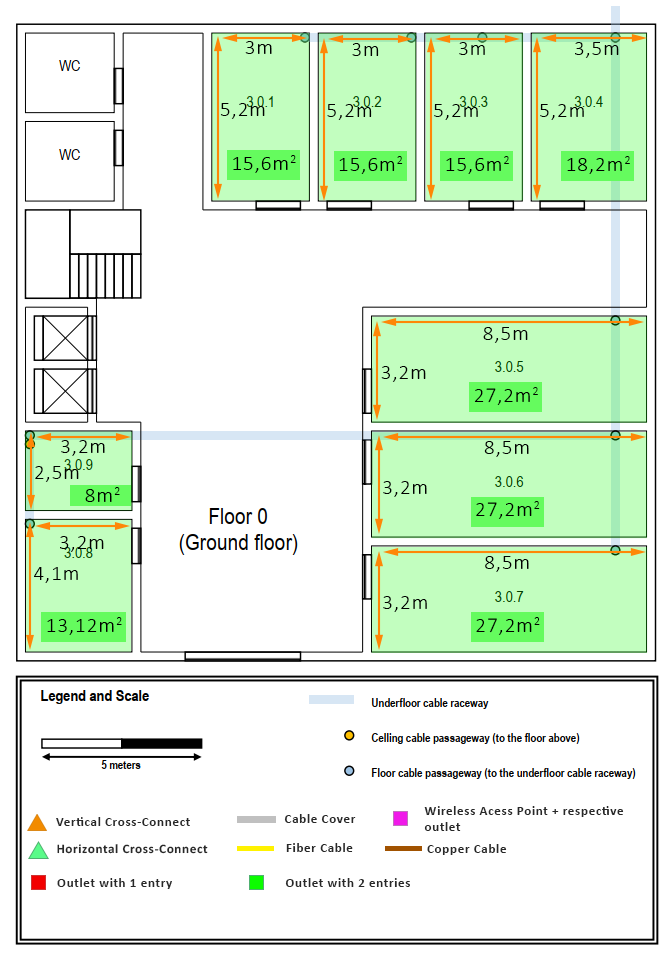

After getting the measurements and figuring out how many outlets each room is gonna need, it was just a matter of trying to distribute them equally across the room having in mind the door placement, since we can assume that there will be no one working right next to the door. 

The end result for the floor 0 was the following:

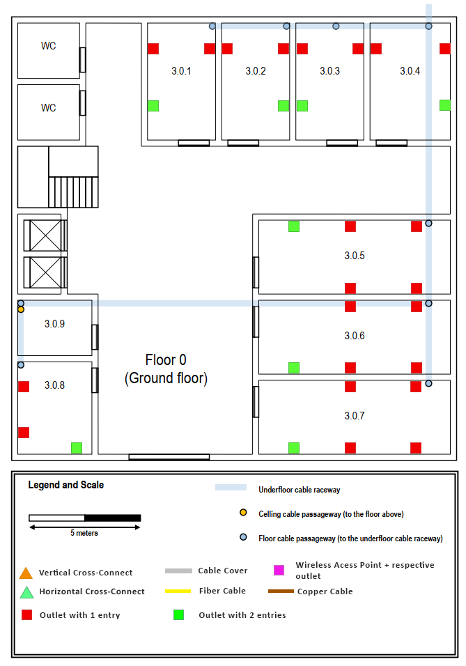

### 1.1.2. Floor 1
In the floor 1 the same rules were applied, first it was necessary to measure the different rooms in order to find how many outlets will be necessary for each room, resulting in the following:

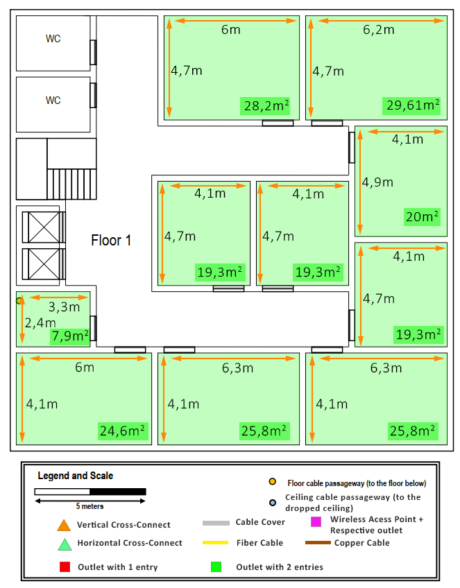

Then it was only necessary to distribute the outlets equaly, ending up with the placements showed bellow:

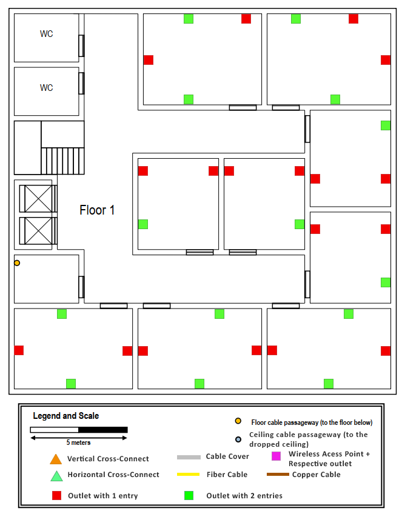

## 1.2. Backbone (Levels of cable distribution)

The diferent levels of cable distribution help us keep everything organized and consist of a Main Cross-connect(MC), an Intermidiate Cross-connect(IC) and a Horizontal Cross-connect(HC). In this building the only levels used were the IC and the HC. 

Placing the racks that will constitute this levels was a simple task, as there is a room in both floor 0 (3.0.9) and floor 1 (3.0.10) that is used as a storage room. 

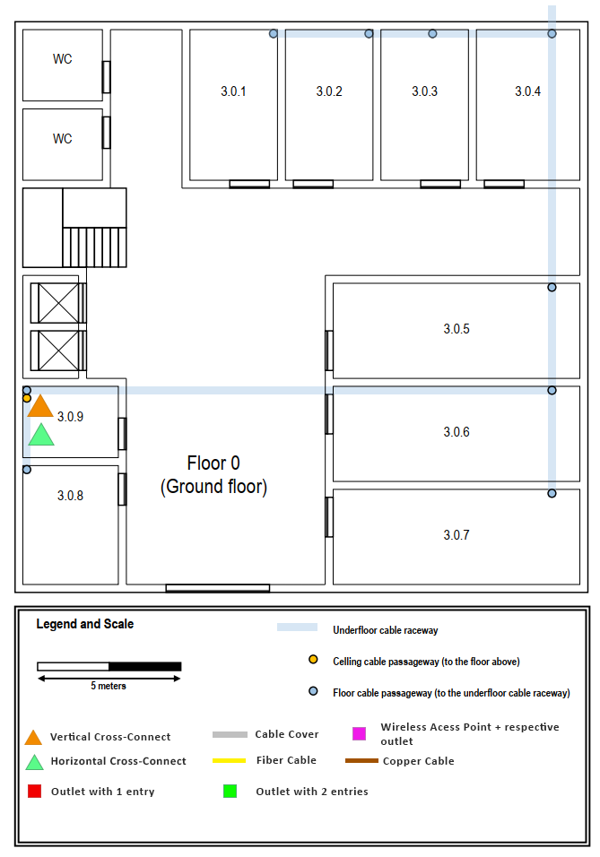

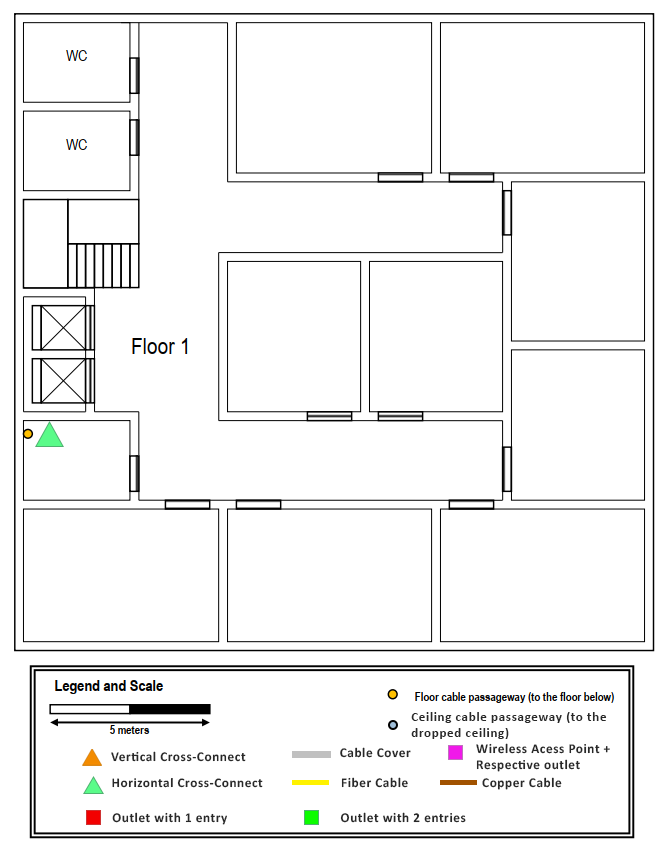

After defining a place for the racks that will house the diferent devices, we need to define how big this racks should be to house the devices necessary, since nothing was said we opted to use the rule of having racks with double the necessary space in order to have a easier time upgrading in the future.

Taking in mind that each outlet and access point require 1 cable and that we decided in the [Technical Decisions](../planning.md) that we were going to have connections of 4 cables between switches (due to redundancy), we need to have enough devices to make that number of connections.

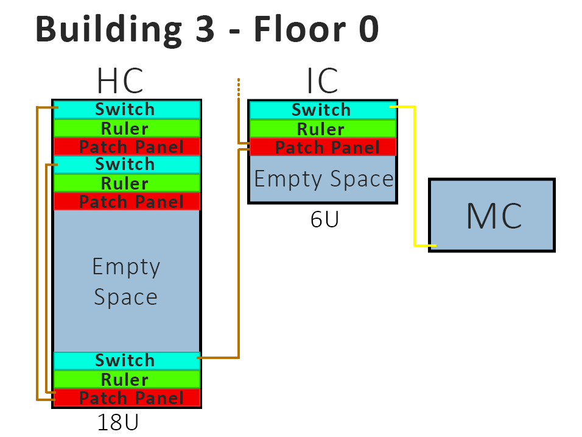

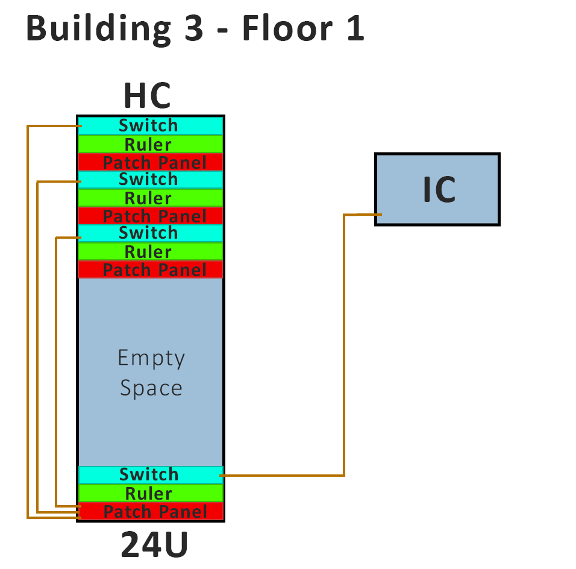

---
## 1.3. Cable distribution 

The cables are what is going to connect the whole system, so it is a crucial part of this project, where we have to keep in mind the different types of cables we need to use and certain restrictions to their length. The choices of cables can be seen in the [Technical Decisions](../planning.md). We also need to take in mind that the cables need to all converge into the backbone, so in our case all of the cables must go to the storage rooms.

### 1.3.1. Floor 0

In this floor we were given an underfloor cable raceway that could be used to distribute the cables to all of the rooms of this floor. Having that in mind getting the cables to all of the different rooms was just a matter of using this raceway, leading to this result:

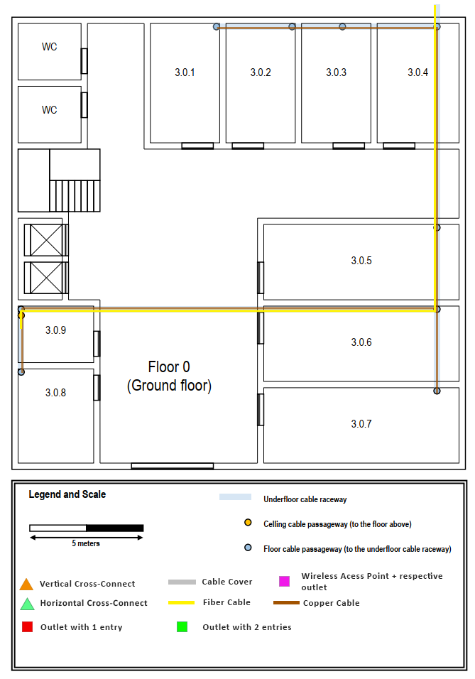

After getting cables to all of the rooms using the raceway, it was now just a matter of getting the cables to the outlets, since now the cables aren't covered by the underfloor raceway, cable covers are used to hide the cables. Another thing to have in mind is that since the outlets are 0,5m above the ground there is an extra 0,5m that the cable needs to have in order to reach the outlets. Other than that the cables are attached to the wall as close as possible to the floor. The last thing to know is that it was attempted to use cables as short as possible (while still mantaining a 5m of excess in each cable). Having all of this in mind the cables were distributed this way:

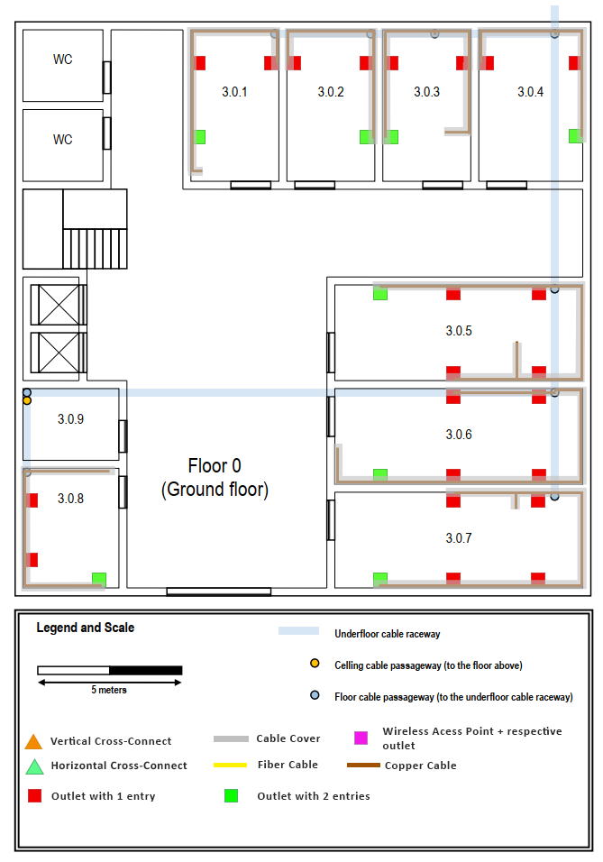

### 1.3.2. Floor 1

When it comes to the floor 1 our job becomes a lot easier, because of the existance of a dropped ceiling which allows us to organize the cables however we want to. This also allows us to not waste nearly as much cable lenght because we can go right to the room that we want to, of course we still need to be careful with the cable placement in order for it to not turn into a giant mess of cables. Another thing to keep in mind is that there needs to be some sort of opening to get the cables from the ceiling to the outlets. The end result for the cable distribution in this floor is the following:

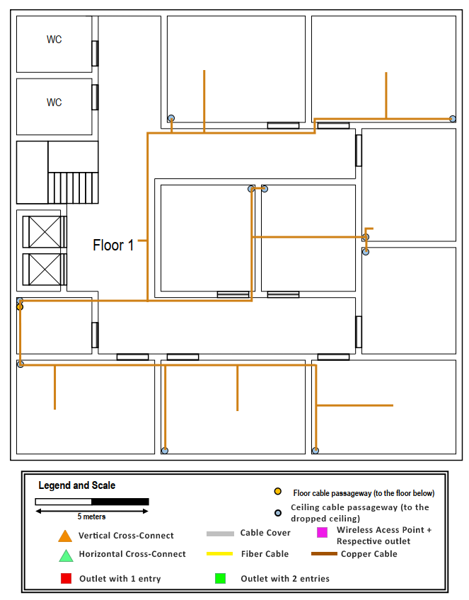

When it comes to the cable distribution in the room itself, the same rules from floor 0 apply but we need to take in mind that the cables aren't coming from the ground but from the ceiling, so the distance is a bit longer.

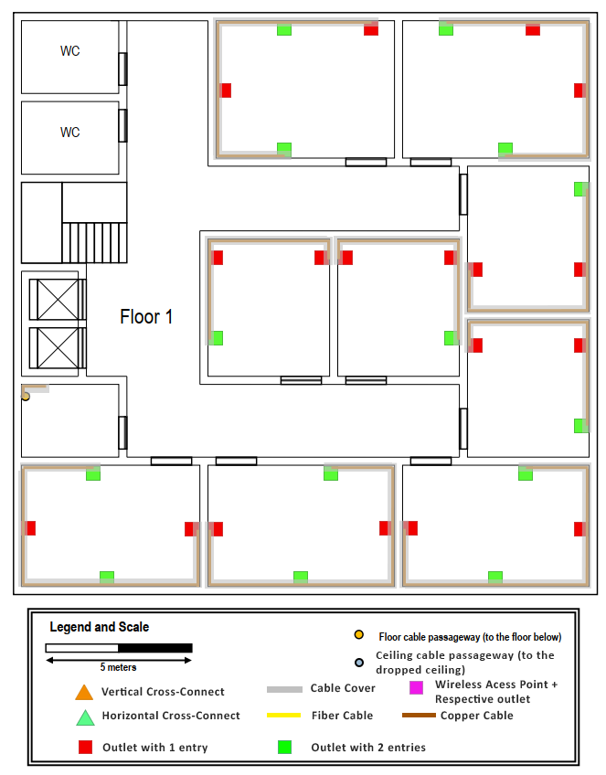

---

## 1.4. Wi-Fi covarage

Wi-fi covarage is one of the hardest parts of this project, if not the hardest, since we need to keep the number of access points to a minimum but still get covarage in as much space as we possibly can. This gets harder once we take in mind that there needs to be some overlapping in order for devices to switch channels easily and without the user noticing, there can only be 30 devices connected per acess point and finally there are only 3 channels that we can use to reduce interferance to a maximum. The Channels chosen and how many devices there are per room can be seen in the [Technical Decisions](../planning.md).

### Floor 0

This floor is tricky since there is no way to get cables to the corridors without having to make holes in the walls, so it was attempted to get as much covarage as possible without having any access points placed in the corridors, of course because of this, not all of the floor has covarage but most of it has it.

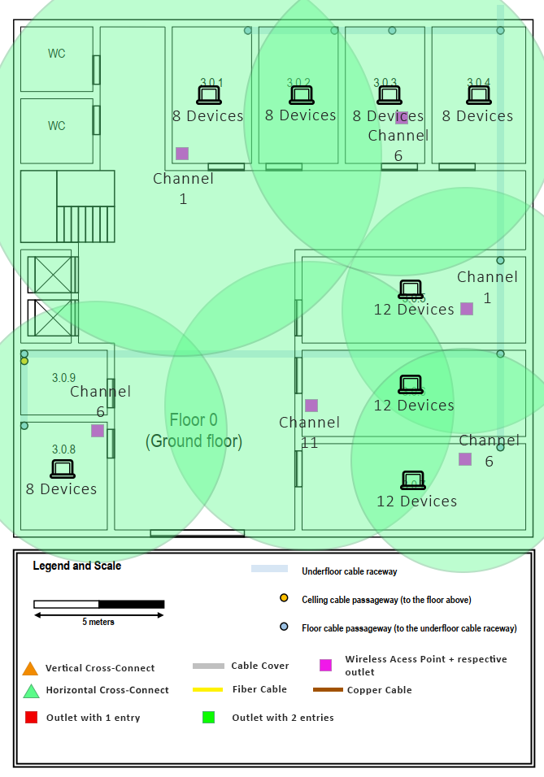

### Floor 1

Due to the existance of the dropped floor making the wi-fi covarage for this floor was easier since we can place access points wherever we need them to be placed, of course this still had its dificulty because there still the other restrictions mentioned before.

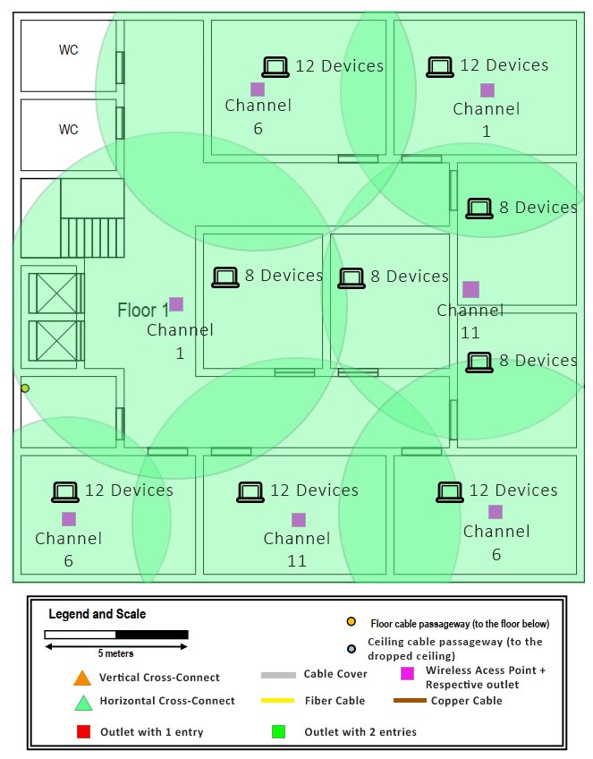

---
## 1.5. Inventory

Having everything defined the last step was to make an inventory of the necessary devices/materials needed to make all of the installations, the total of money necessary for this floor came to 13039,17€.

Device | Number of devices (Floor 0) | Number of devices (Floor 1) | Price per unit | Total price
| --- | --- | --- | --- | --- |  				
Outlet Single Entry | 28 | 25 | 3,38 € | 179,14 € 
Outlet Double Entry	| 8	| 14 | 4,77 € | 104,94 € 
Access Point | 6 | 7 | 169,94 € | 2 209,22 € 
Copper Cables (CAT7) | 1300 | 1100 | 1,70 € | 4 080,00 € 
Fiber Cables (12 Strands) | 35 | 0 | 2,31 € | 80,85 € 
Small Cord Hiders | 130 | 140 | 1,85 € | 499,50 € 
Big Cord Hiders | 4 | 3 | 3,92 € | 27,44 € 
Copper Switches (24 ports) | 5 | 4 | 525,00 € | 4 725,00 € 
Path Panels (24 ports) | 5 | 4 | 32,77 € | 294,93 € 
Fiber Switches (24 ports) | 0 | 0 | 1 759,00 € | -   € 
18U Racks | 1 | 1 | 222,45 € | 444,90 € 
24U Racks | 0 | 1 | 264,00 € | 264,00 € 
6U Racks | 1 | 0 | 129,25 € | 129,25 € 
	Total Price	 13 039,17 € 
