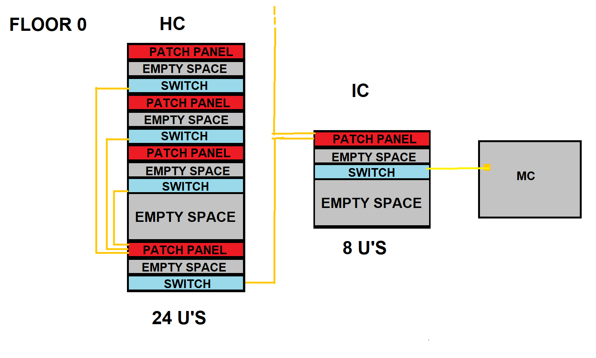
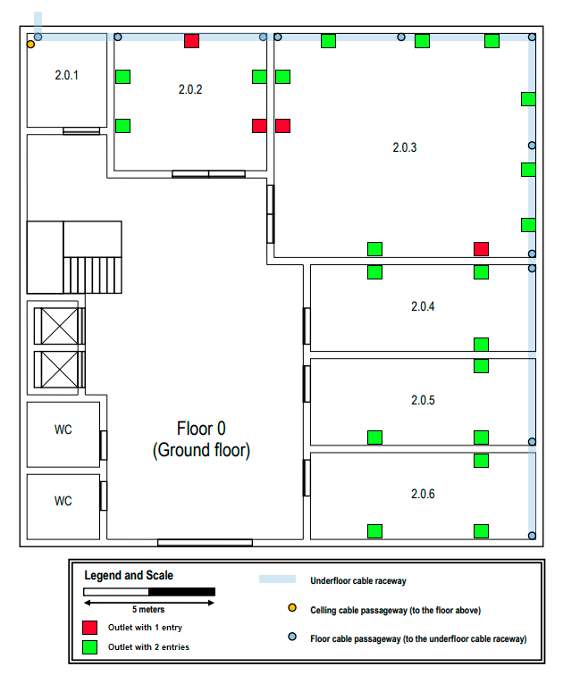
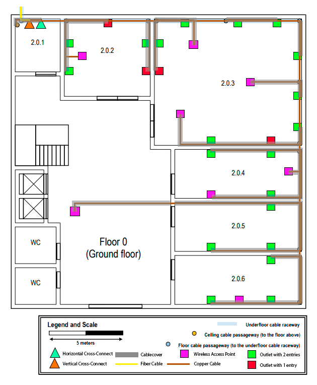
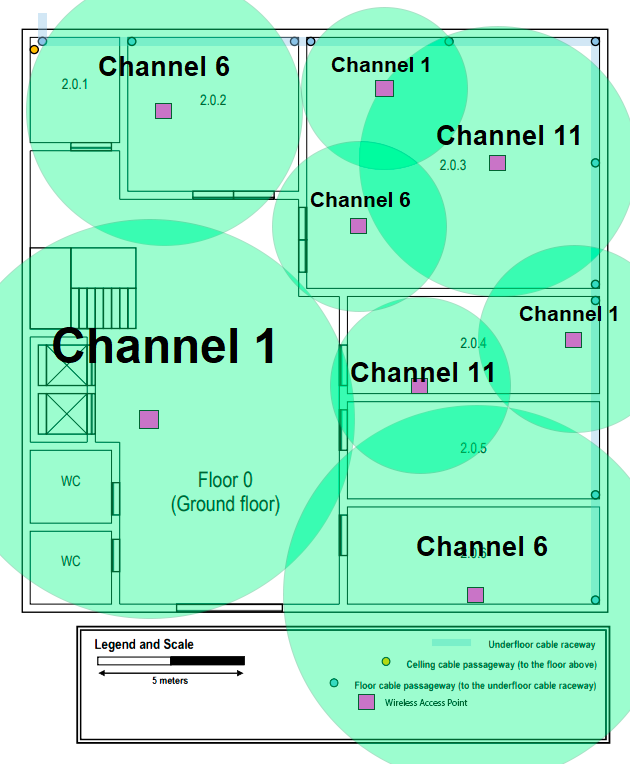
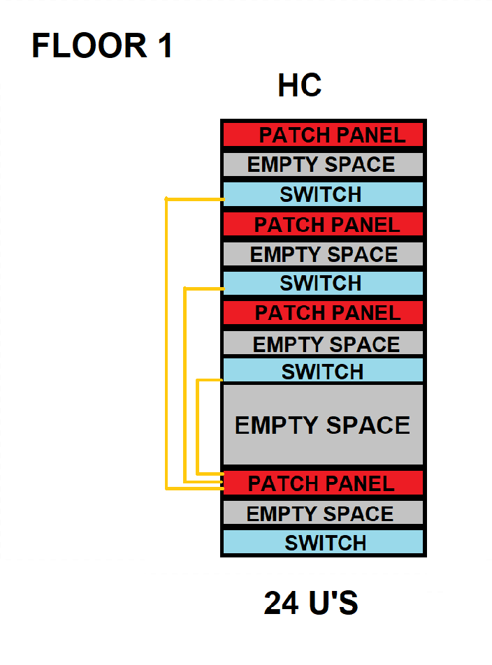
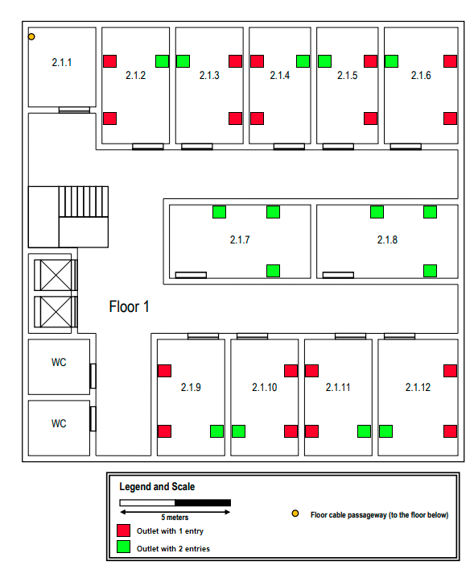
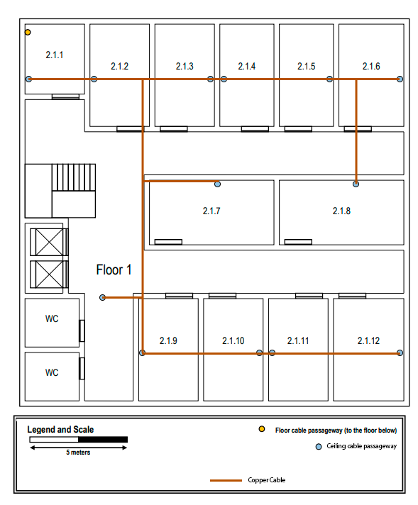
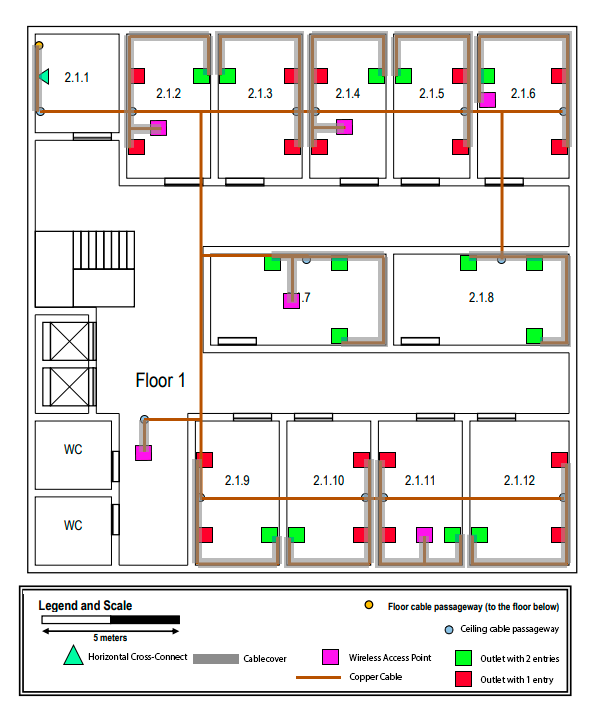
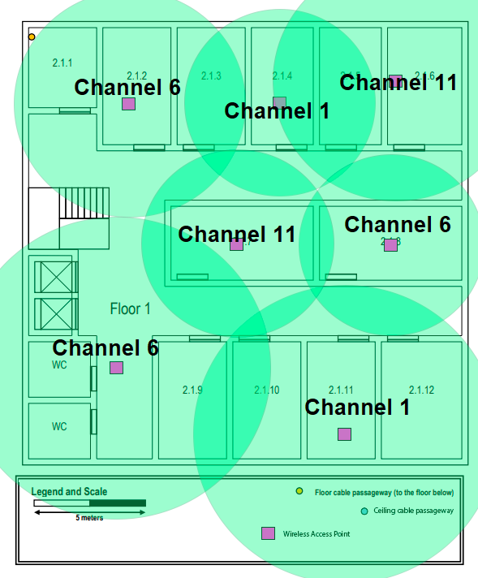

RCOMP 2021-2022 Project - Sprint 1 - Member 1201045 folder
===========================================

This file contains all the details about the infrastructural changes required to implement networking and also wireless connections to the whole of building 2.

# ** Building 2 **

Building 2 is one of the buildings which only requires the connection between all of both its floors.

The inventory and all costs associated at it are available in the file *"Inventory"* that is in the same directory as this file.

The most important images are on this report but in this directory there are several folders with several images of more specific parts of the planning

Like any other building, to ensure fail-safe security, 4-Pair of copper cables will be used in any situation to guarantee that in case of 1 failing, the other 3 pairs will serve as fail safe.

Both floors will be seperately explained more precisely about the outlet positioning, the cabling, the cross-connections organisation, and the access point set up.

## **Floor 0**

### **Enclosures**
    This floor has a storage area located on the Room 2.0.1 to house a Horizontal Cross-Connect (HC) and also a Vertical Cross-Connect (VC) that is connected
    to the Main Cross-Connect (MC) of building 1.

    As the picture shows in the above demonstration the IC is connected to the MC on building 1 by a fiber cable ensuring fast connection. 
    
    This IC is connected to the other two Horizontal Cross-Connects (HC) of the building, these devices will house around 50 cables each. 
    This enclosure will house 4 patch panels receving cable from all of the other end-user devices from floor 0. Each switch is linked with an extra switch that consolidates all other switches and sends their information to the IC. As said earlier all connections are made of 4 copper cables to prevent the fall of the system if one of them is damaged. 
    Even though a rack of 12 U'S does the job here, it was chosen one of 24 U's to accomodate future possible upgrades.
    Also between every Patch Panel and Switch there is an empty space only for cable managment purposes 

### **Outlets**

    Some rules were defined for the placement of outlets: 
     - Every room has 2 outlets per 10 square meters;
     - Outlets were avoided to be placed in front of the main doors because there won't exist any devices; 
     - Almost every wall of the room would have access to at least 1 outlet.
    In order to assure a good distribution of the cables in every room,they were all divided in 4 sections of the same area, the main objective for this was to assure that every section has the same amount of outlets except for the section that contains the door.
    With that in mind the outlet positioning like this:

    With these positions we can now talk about the cable positioning.
    For this we make use of the underfloor raceway, that leads to every room. In the room cable hiders are used to hide the cables and turning the cable placements aesthetically pleasing.
    Also the access points, have their own outlet, being treated just like any other outlet.
    Every outlet on this floor is placed 0,5m above the ground and every acess points will be on the ceiling, the cables that are on the ceiling are also being hidden by cable hiders.
    With all that in mind we end up with this floor plan.

### **Wi-Fi**

    Access Points have their own channels and reach radius, these devices are calibrated in a way that they don't have a neighbouring access point within the same channel and that every access point is taking care of less than 30 devices at once. 
    The channels that are being used are channel 1, 6 and 11.
    The placement of every Access Point tries to not touch a room that would exceed the 30 devices limitation however this is not always possible, so if the AP only touches a small portion of the room then this will be ignored, assuming of course that they have different channels.
    Every outlet is equivalent as 2 devices.
    With all these small rules in mind we end up with the following setup:

## **Floor 1**

### **Enclosures**
    This floor's enclosure will only house a Horizontal Cross-Connect in the room 2.1.1, and as said before, since it will be receving around the same number of cable as the HC in the floor 0, they will also have the same design.

### **Outlets**
    For the outlets, this floor will follow the same rules as the floor 0 having the following setup:

    In this floor there is a drop ceiling 2,5 meters above the floor, which is gonna be used to connect the room 2.1.1 to every other room. However in this building it was used a different aproach, instead of connecting directly to the Ceiling Cable Passageaway we used another aproach that allow us to organize better the cables.

    The room cabling when not able to be hidden by the ceiling, it will be hidden by cable hiders, since every outlet is 0,5m from the ground the cables and its respective cable hider will be pulled down to that height level.
    On the other hand the access points dont have that constraint since they are positioned at around the same height level as the ceiling.

## **Wi-Fi**
    Like floor 0 this floor has the same strategy, they are configured between the three same channels and should not handle more than 30 devices at once.

## **Inventory** 

Things to keep in mind:
- Every cable must have 5 meter of leeway in order to accommodate future changes in the building plans;
- Every device height must be accounted for length count;
- Double outlets count as 2 cables but only as 1 cable hider;
- Patch panels double the amount of incoming cables in order to connect to the switch, a lot of changes in the amount of cables but so much in the length department;
- Cables connecting different switches need to be accounted for;
- Every Access Point has an outlet "attached" but the cable to connect both is not counted as it is technically an extra cable;
- There are 2 types of cord hiders, one is used for regular rooms and accepts around 12 cables the other is only used the HC room in floor 1 because it has to hide a large amount of cables going into the ceiling;

|Item|Quantity|Length/m| 
|---|---|---|
|Single Outlet|36|NA|
|Double Outlet|34|NA|
|Access Point|14|NA|
|Small Cord Hider|NA|323.7|
|Big Cord Hider|NA|4|
|Copper cable Switches|9|NA|
|Copper cable Patch Panels|9|NA|
|24U Rack|2|NA|
|8U Rack|1|NA|
|Copper Cable|NA|3248,44|
|Optic Fibre Cable|NA|6,5|

The total spent was 14566,96€
