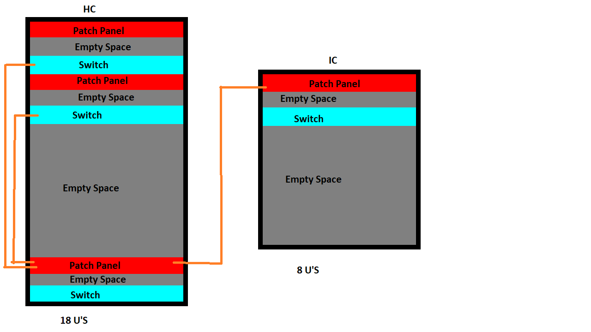
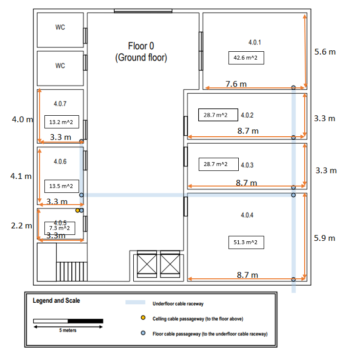
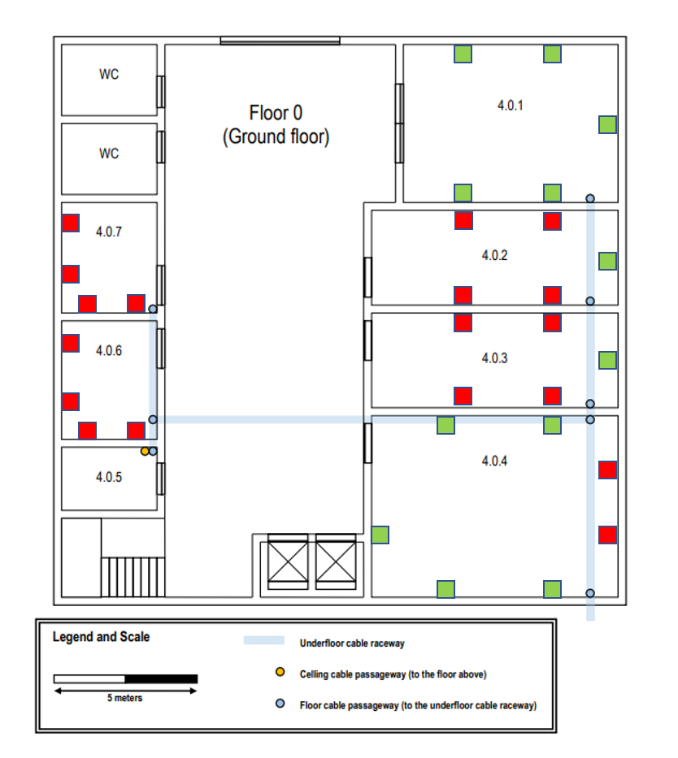
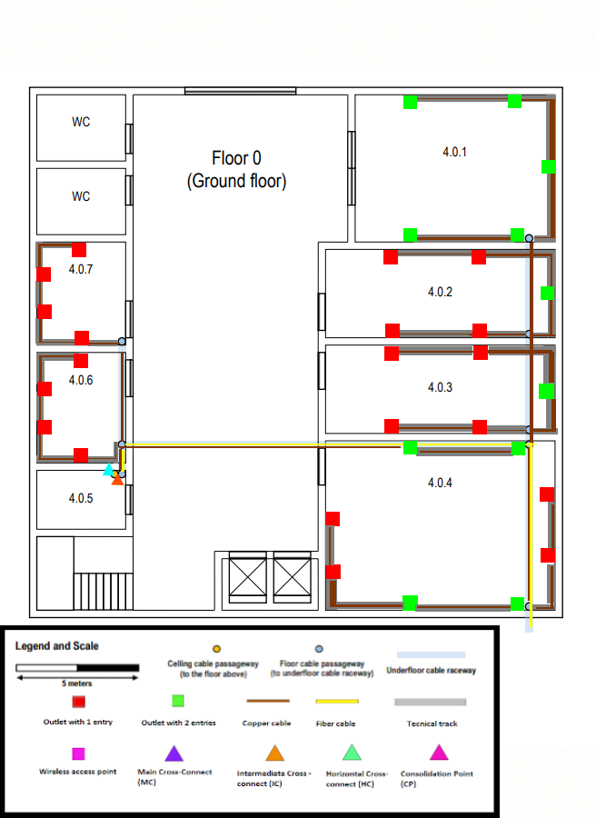
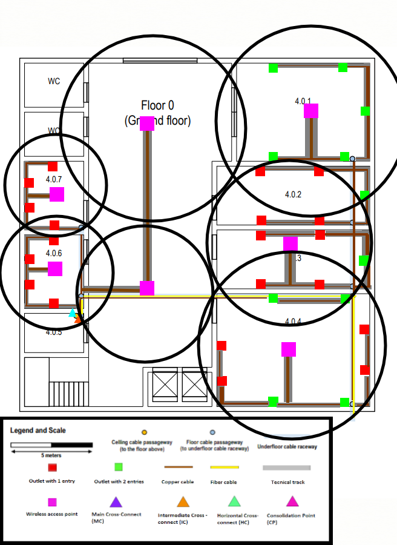
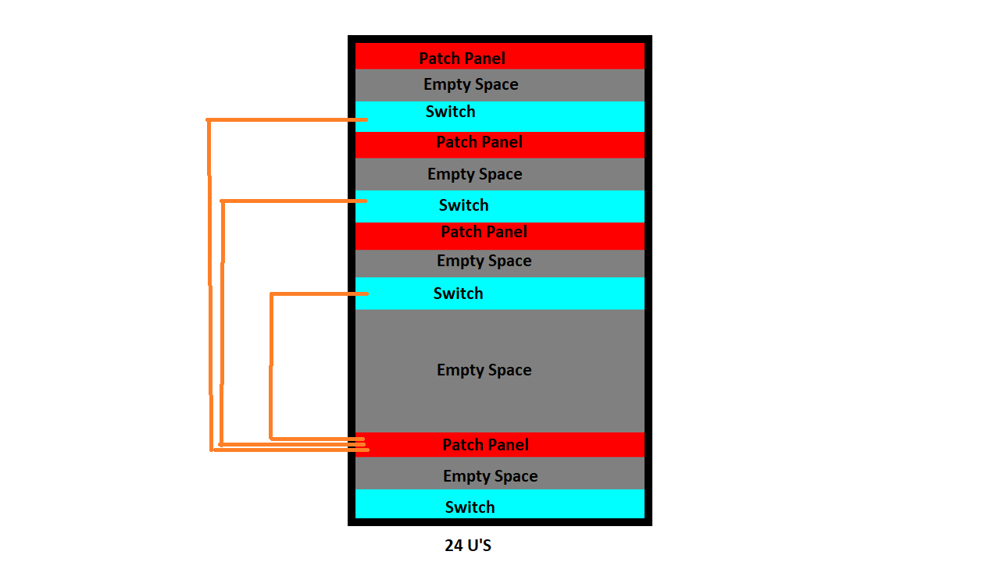
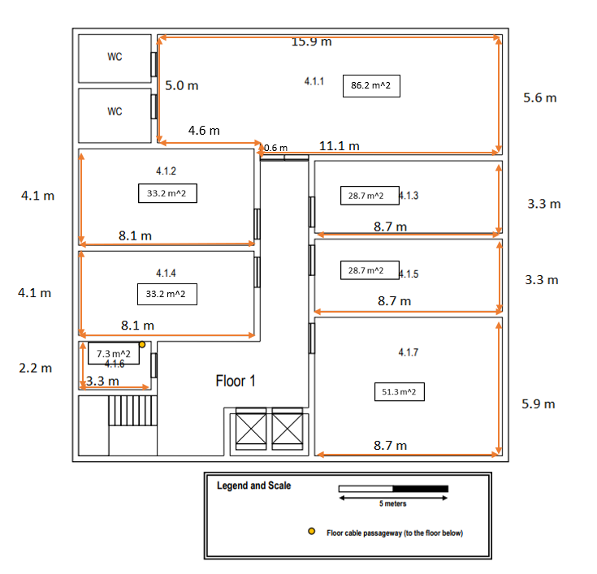
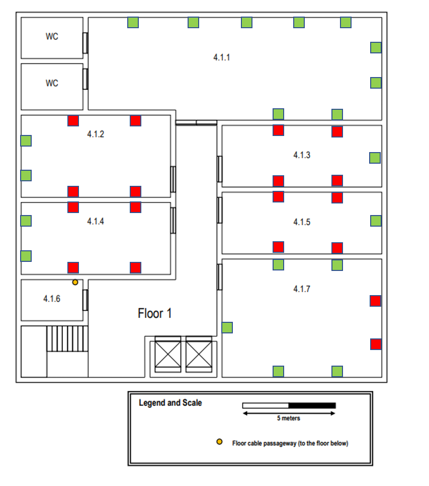
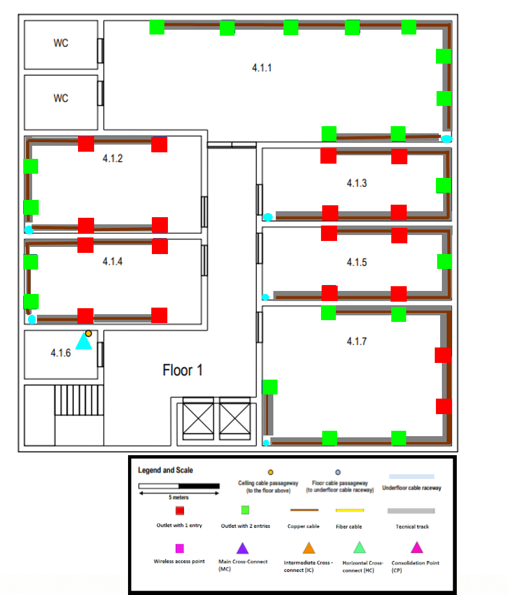
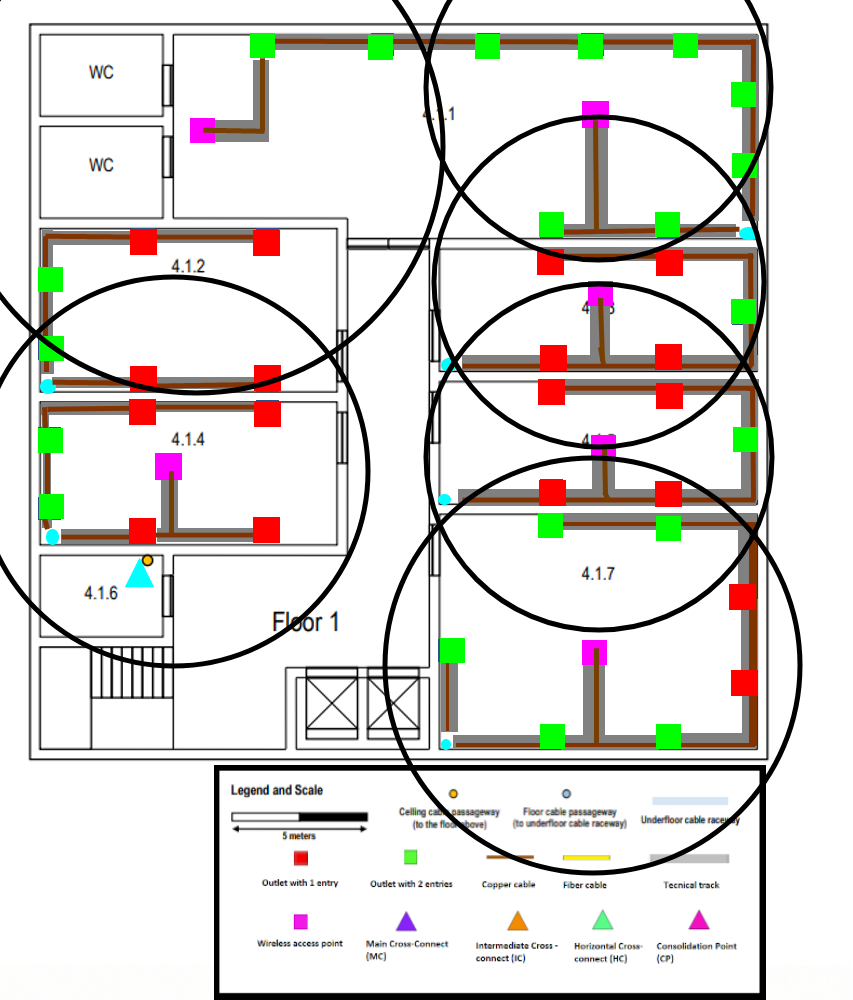

RCOMP 2021-2022 Project - Sprint 1 - Member 1201154 folder
===========================================

This file contains all the infrastructures changes in order to implement netowrking and wireless connections on the Building 4

# ** Building 4 **

This building requires connection to all it's floors. This means both floor 0 and floor 1.

This report will go over all the important aspects of the building, this includes the wireless connection, the cabling system and the cross connection.

At the end of the report you can file an inventory scetion with all the materials needed to replicate what is seen during said report.
## **Floor 0**

### **Enclosures**
    You will be able to find all cross connects on room 4.0.5, also known as the storage room. This room will have an Intermediate Cross Connect (IC) 
    and an Horizontal Cross Connect (HC). The HC will connect to the IC and the IC to buildin's 1 MC. This will allow to install a netowrk on the entire
    building. 

    As you can see by the picture this floor will take use of two different switches, in order to accomodate for
    all the needed cable connections, which this floor has 47 of. The horizontal rack has 18 U, as it uses 2 switches
    to allow the connection of the entire floor and one final switch to connect to the IC. Furthermore the IC rack
    has 8 U, as it only needs 1 switch to connect to all HC racks.

    The empty space between each Patch Panel and Switch allows for an easier cable management.

### **Outlets**
    Before starting we will go over the pre-defined rules for each outlet placement:
        - Every room has 2 outlets per 10 square meters;
        - Every outlet should have a 5 meters of extra cable for an easier maneuvering;
        - Outlets should not be placed in front of doors or any other object that makes it harder to get to them.
        - Every wall should have at least one available outlet. That is if there isn't any obstacle in the way
    With those rules set we can now go over the outlet positions for this particular floor:

    The room measures were added in order to be easier to confirm there's 2 outlets per every 10 square meters.
    If a value is set betweem [10-20] for example we always pick the biggest value of the interval. This means that
    if a room has 11 square meters we will consider the necessary outlets as if the room had 20 square meters.

    The floor cable passeway is what allows for the connection between all the rooms. Once the cable comes out of the floor
    we use small cable hiders to contain all the cables. Then we can distribute every cable to all the available outlets.

    Access Points will have their own outlet, meaning the pictures will treat them like their own outlet and will guide a cable to them.
    Also worth noting that the small cable hiders for the access points is located in the ceiling, while the others ones are located on the floor.

    Finally, every outlet is positioned 0.5m above the ground. If that done, this is the current cable scheme for this floor.

### **Wi-Fi**

    Access points were positioned in a way where every room could have the maximum cover of wireless connection
    without the possibilty of the connection being terminated by going to a spot that's not covered.
    Every access point allows for a total of 30 connected devices. It was defined that each outlet would allow 1 person only
    and that that one person could only connect 2 devices to the wireless network. This scheme also follows that rule.
    

## **Floor 1**

### **Enclosures**
    This floor enclosure is also on the storage area, but contrary to floor 0, it only has an HC in the room 4.1.6

### **Outlets**
    This floor follows the exact same rules set in floor 0. With that in mind, this is the current floor outlet scheme:

    This floor has a drop ceiling that takes 0.5 meters. This means the ceiling height on this floor will be of 2.5 meters.
    The drop ceiling allows for an easier cable management, making it trivial to add cables to each floor.
    Every outlet is still 0.5 meters above the ground, with the only difference being that now, the cable comes from the ceiling,
    meaning it will now need an extra 2 meters of cable in order to postion it.

## **Wi-Fi**
    Just like in floor 0, the same rules are set on this floor.

    As you can see by the image, room 4.1.1 will have a small area without coverage. This is inevitable as this 
    floor's corridor is too tight too allow for an entire room coverage without overlapping.

## **Inventory** 
    Some additional rules:
    - Double Outlets count as 2 different cables
    - Small Cord Hiders are used in regular rooms. 
    - Big Cord Hiders aer used in the storage rooms.
    - Every cable should is counted. This includes cables connecting the patch panels to the switches.
    
|Item| Quantity | Length/m |
|---|----------|----------|
|Single Outlet| 38       | -        |
|Double Outlet| 31       | -        |
|Access Point| 13       | -        |
|Small Cord Hider| -        | 484.8    |
|Big Cord Hider| -        | 2        |
|Copper cable Switches| 8        | -        |
|Copper cable Patch Panels| 8        | -        |
|24U Rack | 1        | -        |
|18U Rack| 1        | -        |
|8U Rack| 1        | -        |
|Copper Cable| -        | 4250     |
|Optic Fibre Cable| -        | 23       |

Total Spent was 16514.92€