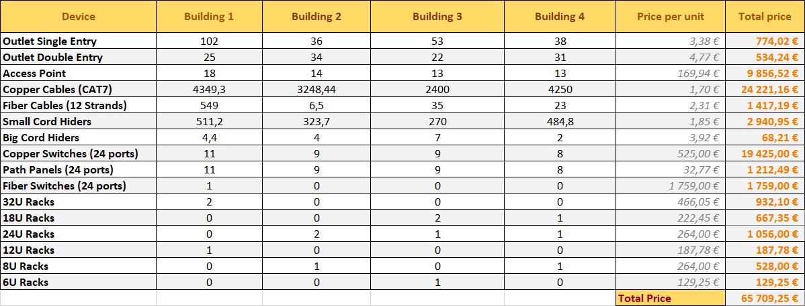

RCOMP 2021-2022 Project - Sprint 1 review
=========================================
### Sprint master: 1201029 ###
# 1. Sprint's backlog #
| **Task** | **Task description** |
| ---- | ---- |
| T.1.1 | Development of a structured cabling project for building 1, encompassing the campus backbone. |
| T.1.2 | Development of a structured cabling project for building 2. |
| T.1.3 | Development of a structured cabling project for building 3. | 
| T.1.4 | Development of a structured cabling project for building 4. |

# 2. Subtasks assessment #

## 2.1. 1200991 - Development of a structured cabling project for building 1, encompassing the campus backbone. #
### Totally implemented with no issues. ###
## 2.2. 1201029 - Development of a structured cabling project for building 3. #
### Totally implemented with no issues. ###
## 2.3. 1201045 -  Development of a structured cabling project for building 2. #
### Totally implemented with no issues. ###
## 2.4. 1201154 - Development of a structured cabling project for building 4. #
### Totally implemented with no issues. ###

# 3. Total Inventory #

