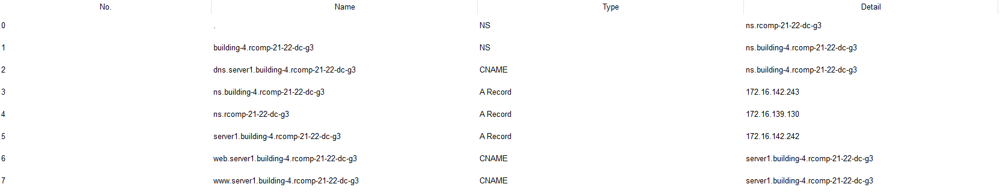

RCOMP 2021-2022 Project - Sprint 3 - Member 1201154 folder
===========================================

# OSPF Dynamic Routing

This sprint was started by switching from static routing to dynamic routing.
We now have 5 different areas. 4 of them represent the different private networks and one represents the backbone.

|  **AREA**    |  **BUILDING**  |
|     ----     |      ----      |
|      0       |    Backbone    |
|      1       |   Building 1   |
|      2       |   Building 2   |
|      3       |   Building 3   |
|      4       |   Building 4   |

Every area is connected to area 0, making the dynamic routing possible between every building.

# HTTP Servers

There are now two servers available, one that everyone can access and another to house the DNS.
They have the following IP addresses:

|  **SERVER**    | **IP**         |
|     ----       |----------------|
|      DNS       | 172.16.142.243 |
|      HTTP      | 172.16.142.242 |

# DHCPv4 Service

The DHCPv4 service allows every device to receive an ip address that is used in a network except for the DMZ network.
To enable the communication between two phones a special option is added to allow that: option 150.

# VoIP Service

To enable the VoIP service the use of a voice vLan is required, in every switch that is connected with an IP Phone and also, the DHCPv4 service previously menitoned must be operational.
Standard phone numbers were decided for every signle building:

|  **BUILDING**  |     **E NUMBER**     |
|     ----       |        ----          |
|       1        |    1001,1002...1999  |
|       2        |    2001,2002...2999  |
|       3        |    3001,3002...3999  |
|       4        |    4001,4002...4999  |

# DNS

The servers contains it's own information that will be connected with other by the main DNS.
The following connections were made:

# NAT

Static nat was used to redirect trafic directly to the servers.
Using the type of request and the port requested, the router is now able to redirect the packet to the specified server  (TCP/80, TCP/443 to the server and TCP/53, UDP/53 to the DNS server). 

# ACL

## Backbone Network

|  **NUMBER**    | **CRITERION**                                 |                         **OBJECTIVE**                          |
|     ----       |-----------------------------------------------|                               ---                              |                      
|1| deny ip 172.16.142.0 0.0.0.255 any            | Deny external spoofing                                         |
|2| permit icmp any any                           | Allows any echo request and reply                              |
|3| permit tcp any 172.16.142.240 0.0.0.15 eq 80  | Allows http, https, and dns requests to the DMZ network        |
|4| permit tcp any 172.16.142.240 0.0.0.15 eq 443 | Allows http, https, and dns requests to the DMZ network        |
|5| permit tcp any 172.16.142.240 0.0.0.15 eq 53  | Allows http, https, and dns requests to the DMZ network        |
|6| permit udp any 172.16.142.240 0.0.0.15 eq 53  | Allows http, https, and dns requests to the DMZ network        |
|7| deny ip any 172.16.142.240 0.0.0.15           | Denies all other requests                                      |
|8| permit ospf any host 172.16.136.4             | Allows the ospf service to work                                |
|9| permit tcp any host 172.16.136.4 eq 80        | Allows the router to receive http, https, and dns requests     |
|10| permit tcp any host 172.16.136.4 eq 443       | Allows the router to receive http, https, and dns requests     |
|11| permit tcp any host 172.16.136.4 eq 53        | Allows the router to receive http, https, and dns requests     |
|12| permit udp any host 172.16.136.4 eq 53        | Allows the router to receive http, https, and dns requests     |
|13| ermit tcp any host 172.16.136.4 eq 1028       | Allows call forwarding between Ip phones                       |
|14| permit tcp any host 172.16.136.4 eq 1720      | Allows call forwarding between Ip phones                       |
|15| permit tcp any eq 1720 host 172.16.136.4      | Allows call forwarding between Ip phones                       |
|16| deny ip any host 172.16.136.4                 | Denies any other type of request to the given router           | 
|17| permit ip any any                             | Allows every other type of access to the network               |

## Private Network

For the Wi-Fi, Floor 1 and Floor 0 the ACL used are:

|  **NUMBER**    |     **CRITERION**                |                         **OBJECTIVE**                          |
|     ----       |        ----                      |                               ---                              |      
|1|permit icmp 172.16.142.0 0.0.0.127 any          | Permits echo request and echo replies sent through the network |
|2|permit ip host 0.0.0.0 host 255.255.255.255      | Makes sure that the DHCP service works                         |
|3|deny ip any host 172.16.142.1                  | Denies any further use of the router and stops spoofing        |
|4|permit ip 172.16.142.0 0.0.0.127 any            | Denies any further use of the router and stops spoofing        |

The DMZ uses the same ACLS except for those meant to reduce spoofing as this is a trusted network.
The VoIP network used extra acls to accommodate the heightened need of the IP phones:

|  **NUMBER**    |     **CRITERION**                |                         **OBJECTIVE**                          |
|     ----       |        ----                      |                               ---                              |      
|1|permit icmp 72.16.142.224 0.0.0.25 any          | Permits echo request and echo replies sent through the network |
|2|permit ip host 0.0.0.0 host 255.255.255.255      | Makes sure that the DHCP service works                         |
|3|permit tcp any host 172.16.142.225 eq 2000       | Allows the use of VoIP function to operate ephones             |
|4|permit tcp any host 172.16.142.225 eq 1028       | Allows the use of VoIP function to operate ephones             |
|5|permit tcp any host 172.16.142.225 eq 1720       | Allows the use of VoIP function to operate ephones             |
|6|permit tcp any eq 1720 host 172.16.142.225      | Allows the use of VoIP function to operate ephones             |
|7|deny ip any host 172.16.142.225                 | Denies any further use of the router and stops spoofing        |
|8|permit ip 172.16.142.224 0.0.0.25 any            | Denies any further use of the router and stops spoofing        |
